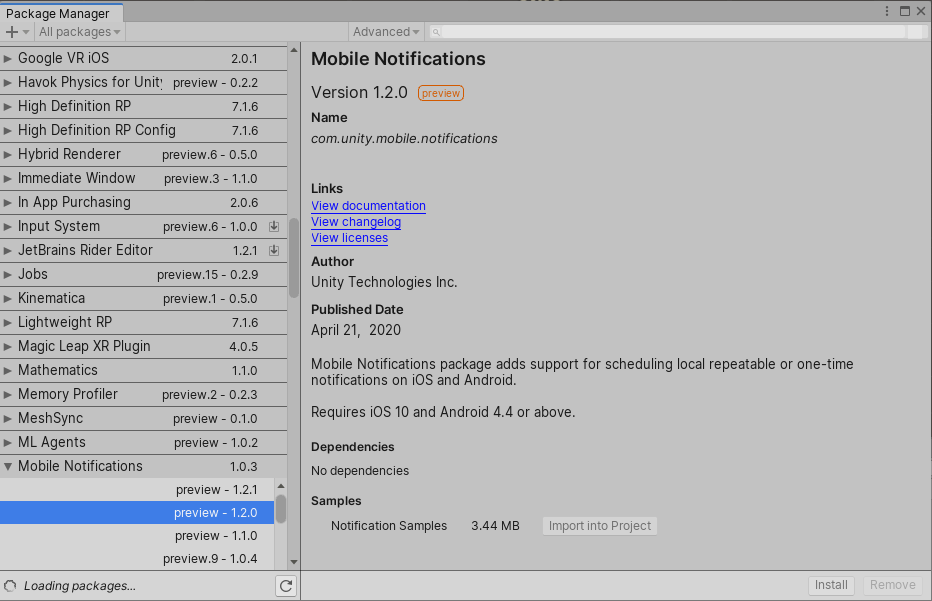

# Notification Samples

The Unity Mobile Notifications package includes a sample which shows how to use the package in real-world scenarios. You can install this sample from the package description page in the Package Manager window, as shown below.

You can also download the source of the sample from the [Notification Samples](https://github.com/Unity-Technologies/NotificationsSamples) repository on GitHub.
